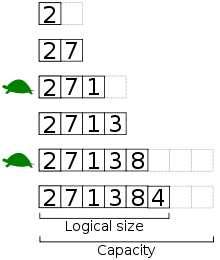

## ARRAY
Linear Data Structure used to store multiple items of same datatype in the continuous memory location
##### Disadvantages
- Homogeneous (Same type)
- Fixed size 

### How to store different types of data in array?
By using Referential Array:
In referential array we used to store the address of the memory-location the item.
So the array contains [1004, 1008, 2104] etc and these are the addresses contain 'Saif', 24 , 1.45
This method is knowns as _call by reference_  

### How to create dynamic size of array (so we can save space in memory)?
In dynamic arrays we double the size of array and copy the previous items in the double size array.

